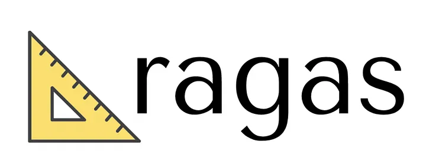
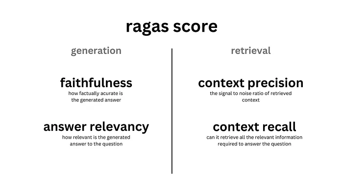

# Evaluating RAG Applications with Ragas

## Overview
Ragas is an open-source framework designed for systematically evaluating Retrieval-Augmented Generation (RAG) pipelines. RAG has become a popular architecture for building applications powered by large language models (LLMs), such as chatbots and document assistants. By combining retrieval with generation, RAG enables language models to provide more grounded and factual answers using external knowledge sources.

However, just because a system uses RAG doesn't guarantee accuracy. It may still hallucinate, retrieve irrelevant context, or generate incomplete or misleading answers. Ragas helps address these challenges by providing a structured way to measure how well your system retrieves relevant information, grounds its answers, and delivers useful responses without the need for human annotators.

### Metrics
Ragas evaluates RAG pipelines across two core components: generation and retrieval.

- **Generation Metrics (LLM-based)**:
  - **Faithfulness**: Measures the factual accuracy of the generated answer and its grounding in the retrieved documents.
  - **Answer Relevancy**: Assesses how relevant the generated answer is to the user's question.

- **Retrieval Metrics (Non-LLM & LLM-based)**:
  - **Context Precision**: Evaluates the proportion of retrieved contexts that are useful.
  - **Context Recall**: Determines if the system retrieved all relevant information needed to answer the question.

## Technologies Used
This project utilizes the following technologies:
- **Python**: The primary programming language for the scripts.
- **Ragas**: The framework for evaluating RAG applications.
- **Langchain**: For integrating language models and embeddings.
- **Hugging Face**: For embeddings and semantic similarity tasks.

## Results
The evaluation results provide insights into the performance of the RAG pipeline, including metrics for context precision, context recall, answer faithfulness, and relevancy. These metrics help ensure that both the retriever and generator components are functioning effectively.

## Source
For more detailed information, please refer to my article on Medium: [Evaluating Retrieval-Augmented Generation (RAG) Applications with Ragas](https://medium.com/@diegoprayudha1/evaluating-retrieval-augmented-generation-rag-applications-with-ragas-4ae2bb92bd27).

Additionally, you can find the official Ragas documentation here: [Ragas Documentation](https://docs.ragas.io/en/stable/)